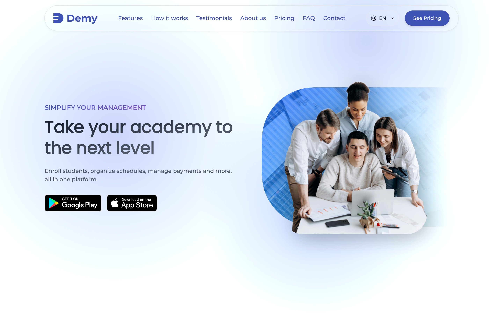
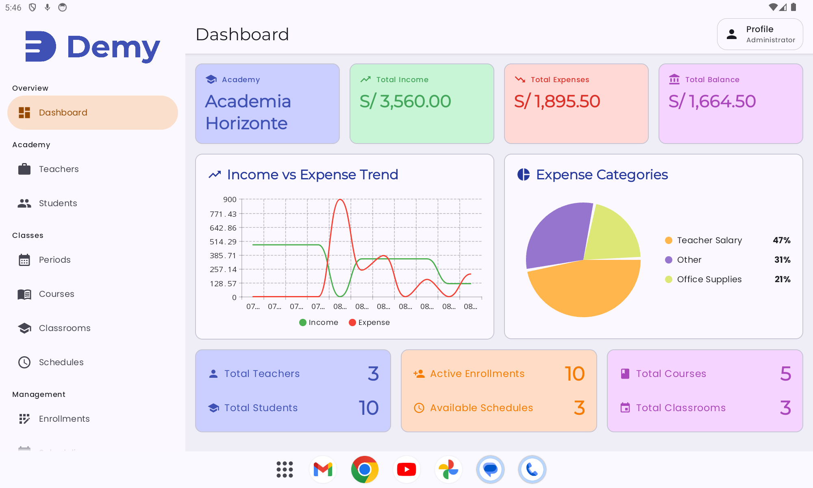
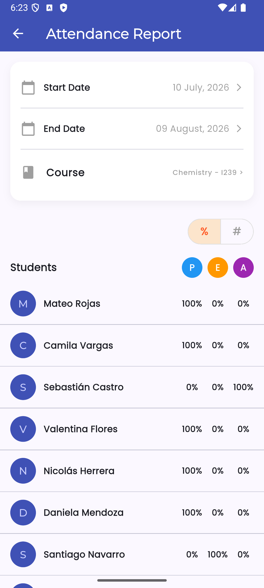
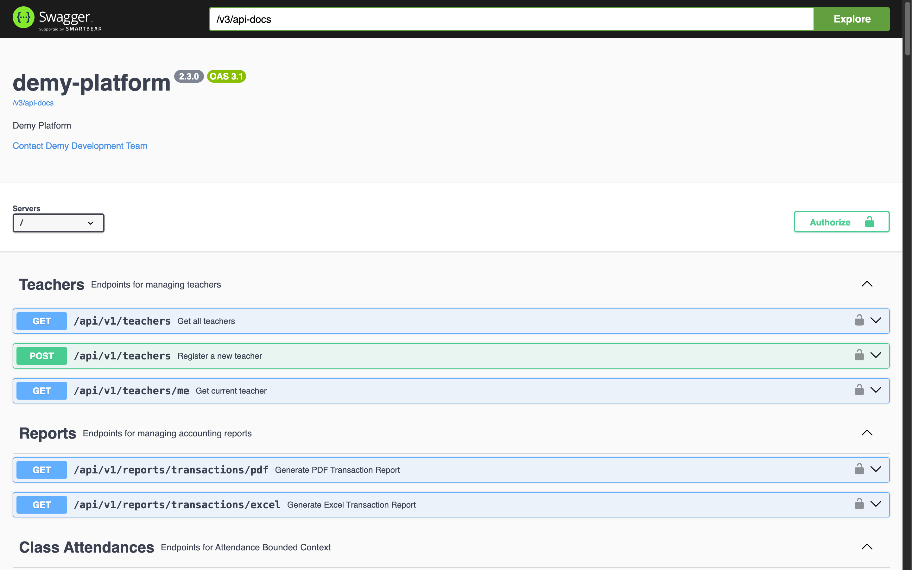

  

<h1 align="center">Demy by Nistra</h1>

  One connected platform for academy operations, from enrollment and scheduling to attendance, billing, and financial visibility.

  <a href="./README.md">English</a> · <a href="./README.es.md">Español</a>

## One product, five connected experiences

**Demy** helps educational academies coordinate administrators, teachers, and students around the same operational data. A shared REST API connects a public landing page, a tablet workspace for administrators, and dedicated mobile experiences for teachers and students.

| Experience | Purpose | Technology |
| --- | --- | --- |
| [Demy Landing](https://github.com/nistrahq/demy-landing) | Product discovery, pricing, team, and contact | Vite, Tailwind CSS, JavaScript |
| [Demy Admins](https://github.com/nistrahq/demy-admins) | Academy operations, enrollment, billing, and finance | Kotlin, Jetpack Compose |
| [Demy Teachers](https://github.com/nistrahq/demy-teachers) | Teaching schedules, rescheduling, and attendance | Flutter, Dart |
| [Demy Students](https://github.com/nistrahq/demy-students) | Personal schedules, academy updates, profile, and settings | Swift, SwiftUI |
| [Demy API](https://github.com/nistrahq/demy-api) | Shared business capabilities and integrations | Java 21, Spring Boot, MySQL |

## Product tour

### Discover Demy

### Run academy operations

### Support teachers and students

<table>
  <tr>
    <td width="50%" align="center">
      
    </td>
    <td width="50%" align="center">
      
    </td>
  </tr>
</table>

### Connect every client through one API

## Our direction

Nistra builds practical software for educational academies in Peru. With Demy, our goal is to make daily administration more organized, transparent, and accessible for every participant in the academic community.
